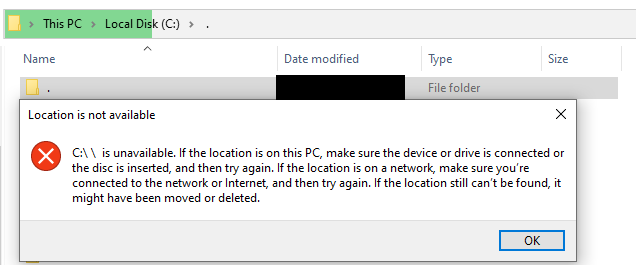

# Bug explaination  

**NtCreateFile** can create and access directories using names like " .", " ..", " . . . . " and so on but **CreateFile** can't do it. It replaces it by " " which is an absolutely different directory.  
See the following screenshot taken when accessing to " ." using **explorer.exe**.  

# Implications  

1. You can hide malware from antivirus agents which uses CreateFile to access files and directories.  
2. You can also hide malware from users who uses programs like **explorer.exe** and **cmd.exe** which, finally, relies on CreateFile.

# Disclosure  

Microsoft will not fix this issue because of the following reason:  
"This is a known portion of the file structure and is detailed online. Beyond that, an attacker would already need to have compromised a machine to make use of this".  

I decided to publish the code.  

# PoC  

[PoC file](./PoC.c)  
[Mini DDK dependencie](./miniddk.h)  

# Debugger session  

#### 1. Kernel32!CreateFileW calls to KERNELBASE!CreateFileInternal  
771de463 8364240c00      and     dword ptr [esp+0Ch],0  
771de468 8b4514          mov     eax,dword ptr [ebp+14h]  
771de46b 8b550c          mov     edx,dword ptr [ebp+0Ch]  
771de46e 8b4d08          mov     ecx,dword ptr [ebp+8]      ; u"C:\ .\my_hidden_malware.exe"  
771de471 89442410        mov     dword ptr [esp+10h],eax  
771de475 8b4520          mov     eax,dword ptr [ebp+20h]  
771de478 6a00            push    0  
771de47a 89442418        mov     dword ptr [esp+18h],eax  
771de47e 8d442404        lea     eax,[esp+4]  
771de482 50              push    eax  
771de483 ff7518          push    dword ptr [ebp+18h]  
771de486 ff7510          push    dword ptr [ebp+10h]  
771de489 e812000000      call    KERNELBASE!CreateFileInternal (771de4a0)  
  
  
#### 2. Debugging session in KERNELBASE!CreateFileInternal  
KERNELBASE!CreateFileInternal:  
771de4a0 8bff            mov     edi,edi  
771de4a2 55              push    ebp  
771de4a3 8bec            mov     ebp,esp  
771de4a5 83e4f8          and     esp,0FFFFFFF8h  
771de4a8 81ec84000000    sub     esp,84h  
771de4ae a1307b2a77      mov     eax,dword ptr [KERNELBASE!__security_cookie (772a7b30)]  
771de4b3 33c4            xor     eax,esp  
771de4b5 89842480000000  mov     dword ptr [esp+80h],eax  
771de4bc 53              push    ebx  
771de4bd 56              push    esi  
771de4be 8b7510          mov     esi,dword ptr [ebp+10h]  
771de4c1 8bd9            mov     ebx,ecx                 ; u"C:\ .\my_hidden_malware.exe"  
  
  
#### 3. RtlInitUnicodeStringEx works well putting u"C:\ .\my_hidden_malware.exe" into [esp+34]    
Llama a _imp__RtlInitUnicodeStringEx....  
771de4fe c744241401000000 mov     dword ptr [esp+14h],1  
771de506 53              push    ebx                    ; Source  
771de507 8d442434        lea     eax,[esp+34h]  
771de50b 50              push    eax                    ; <----- Destination  
771de50c ff1570b12a77    call    dword ptr [KERNELBASE!_imp__RtlInitUnicodeStringEx  

0:000:x86> du poi(esp+34)  
0040422c  "C:\ .\my_hidden_malware.exe"  
  
  
#### 4. Then, the string is passed to KERNELBASE!_imp__RtlDosPathNameToRelativeNtPathName_U_WithStatus  
771de549 50              push    eax  
771de54a 6a00            push    0  
771de54c 8d442438        lea     eax,[esp+38h]  
771de550 50              push    eax  
**771de551 53              push    ebx                   ; "C:\ .\my_hidden_malware.exe"**  
771de552 ff1538b92a77    call    dword ptr [KERNELBASE!_imp__RtlDosPathNameToRelativeNtPathName_U_WithStatus (772ab938)] ds:002b:772ab938={ntdll_77d00000!RtlDosPathNameToRelativeNtPathName_U_WithStatus (77d412f0)}  

  

#### 5. And then, the vulnerability happens.  
771de552 ff1538b92a77    call    dword ptr [KERNELBASE!_imp__RtlDosPathNameToRelativeNtPathName_U_WithStatus (772ab938)]  
771de558 85c0            test    eax,eax  
771de55a 0f88f61e0300    js      KERNELBASE!CreateFileInternal+0x31fb6 (77210456)  
**771de560 8b442434        mov     eax,dword ptr [esp+34h] ; "\??\C:\ \my_hidden_malware.exe"**  